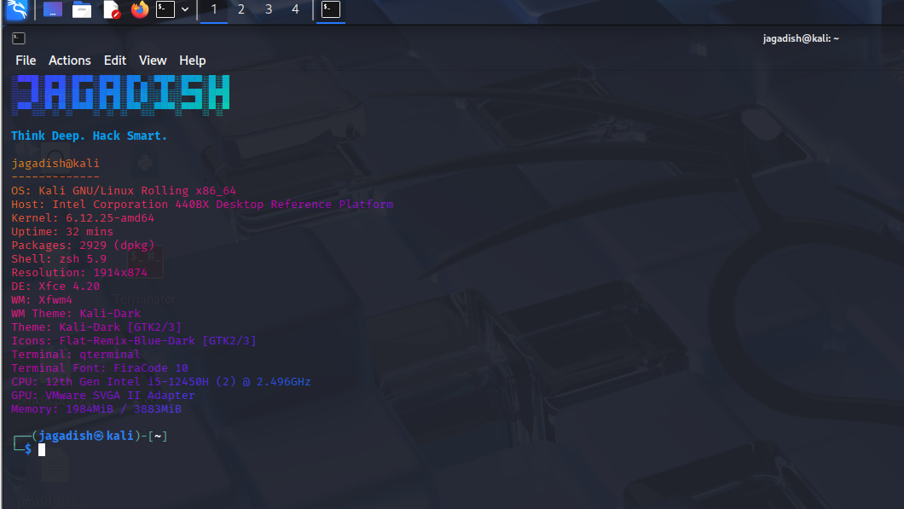

# 💻 Terminal Upgrade - Customize Your Own Linux Terminal


---

Welcome to the **Terminal Upgrade** repository! 🎉

This guide helps you **customize your Kali Linux terminal** to make it more attractive, colorful, and hacker-style.

Whether you're a beginner or advanced user, follow along to get:

- Your name in a cool banner

- A hacker-style quote

- System info displayed automatically

- All styled with vibrant colors using `lolcat` and `figlet`

---

## 🛠️ What You'll Get

✅ Name in big ASCII font  

✅ Slogan below the banner  

✅ System info via `neofetch`  

✅ Smooth color gradients with `lolcat`

---

## ⚙️ Prerequisites (Must Do First)

### 1. Update and Upgrade Your System

Before installing anything, it's important to update your system:
```
sudo apt update && sudo apt upgrade -y

```
⛔ Why?

Because without upgrading, some packages like `figlet` or `lolcat` might not install properly!

2\. Check Which Shell You're Using

Open your terminal and run:
```
echo $SHELL

```
You'll see something like:

`/usr/bin/zsh` → ✅ You're already using ZSH. Jump to step 4.

`/bin/bash` → You're using Bash. Continue to step 3 to switch.

3\. Switch to ZSH (If You're on Bash)
```
sudo apt install zsh -y
chsh -s /bin/zsh
```
Now close your terminal and reopen it --- you're now using ZSH ✅

4\. Install Required Packages

These tools create the stylish look:
```
sudo apt install figlet lolcat neofetch mousepad -y

```
💡 Why mousepad instead of nano?

Because it's easier to use --- you can scroll, click, and edit just like in Notepad!

🎨 Customize Your Terminal Banner

Let's make your terminal look awesome every time you open it.

Step 1: Open `.zshrc` in Mousepad
```
mousepad ~/.zshrc

```
Step 2: Scroll to the Bottom and Paste This:
```
# ────────[ Jagadish Terminal Banner ]────────
clear
figlet -f pagga "Jagadish" | lolcat
echo -e "\e[1;36mThink Deep. Hack Smart.\e[0m"
neofetch
# ────────────────────────────────────────────
```
🧠 Customize it!

Change "Jagadish" to your own name or handle

Update the slogan if you'd like

✅ Final Step: Apply the Changes

Save the file and run:
```
source ~/.zshrc

```
🎉 Boom! Your terminal now looks 🔥 every time you open it.

🧯 Troubleshooting
---
- Banner not showing?

  Make sure the code is at the bottom of `.zshrc`

- Commands not found?

  Run `sudo apt update && sudo apt install figlet lolcat neofetch -y`

- Still using Bash?

  Try logging out and logging in again to activate ZSH

🙌 Contribution
---
Feel free to fork this repo, change styles, add animations, or even fonts!

If you improve this script, submit a Pull Request and share the love 💖
